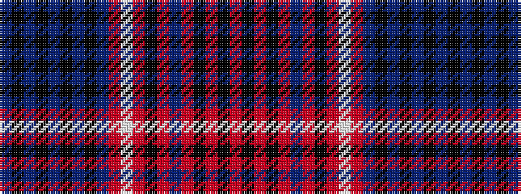

BKBKBKBKBRWRKRBRKRKR

It is a 20 stripe tartan.

<figure class="pat-woven">

<figcaption>idealised sample</figcaption>
</figure>

## Colour Sequence



## Tartans with this colour sequence

| Tartans |
|---------------|
| [Club World (Corporate)](/setts/s20/db14k7db21k2db2k2db2k4db7r25w2r2k3r16db9r2k4r2k4r2~x2/)|
||
