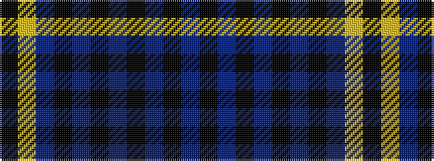

BKBKBKBKBYK

It is a 11 stripe tartan.

<figure class="pat-woven">

<figcaption>idealised sample</figcaption>
</figure>

## Colour Sequence



## Tartans with this colour sequence

| Tartans |
|---------------|
| [Churchill (Personal)](/variants/s11/db12ki1t2ki1dbi9ki7dp2ki2dp2ly1k2~x4/)|
||
