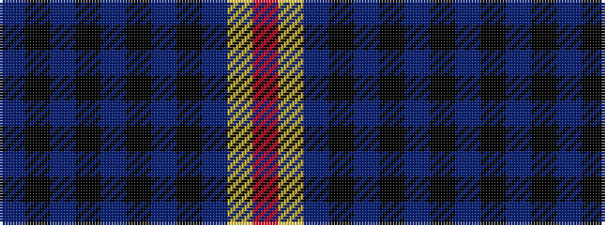

BKBKBKBKBYR

It is a 11 stripe tartan.

<figure class="pat-woven">

<figcaption>idealised sample</figcaption>
</figure>

## Colour Sequence



## Tartans with this colour sequence

| Tartans |
|---------------|
| [Churchill (Personal)](/variants/s11/db12k1t2k1dbi9k7dp2k2dp2ly1r2~x4/)|
||
