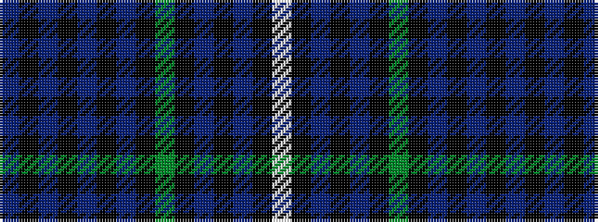

BKBKBKBKGKBKBKW

It is a 15 stripe tartan.

<figure class="pat-woven">

<figcaption>idealised sample</figcaption>
</figure>

## Colour Sequence



## Tartans with this colour sequence

| Tartans |
|---------------|
| [McCruden, Raymond (Personal)](/setts/s15/db15k4db4k4db4k16t16k2g3k2t16k16db18k1w2~x2/)|
||
