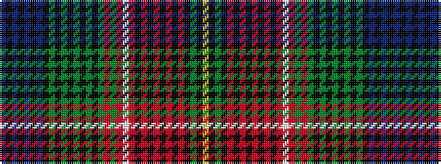

BKBKBKBKGKGKGKGKGRGRWRKRKRKRKRKGKY

It is a 34 stripe tartan.

<figure class="pat-woven">

<figcaption>idealised sample</figcaption>
</figure>

## Colour Sequence



## Tartans with this colour sequence

| Tartans |
|---------------|
| [Paisley Fancy Reduced](/setts/s34/db8k2db3k2db2k3db2k11g2k4g3k3g4k2g5k2g55r4g11r11w4r66k2r5k2r4k3r3k4r2k11g15k2ly4/)|
||
