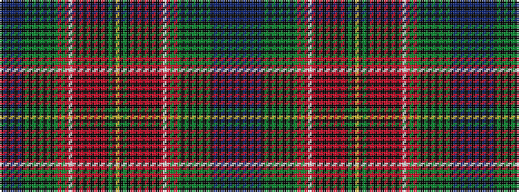

BKBKBKBKGKGKGKGKGRGRWRKRKRKRKRKGKYKGKRKRKRKRKRWRGRGKGKGKGKGKBKBKBK

It is a 66 stripe tartan.

<figure class="pat-woven">

<figcaption>idealised sample</figcaption>
</figure>

## Colour Sequence



## Tartans with this colour sequence

| Tartans |
|---------------|
| [Unidentified (Paisley)](/setts/s66/db4k1db2k1db1k2db1k6g1k2g2k2g2k1g3k1g28r2g6r6w2r33k1r3k1r2k2r2k2r1k6g8k1ly2~x2/)|
||
