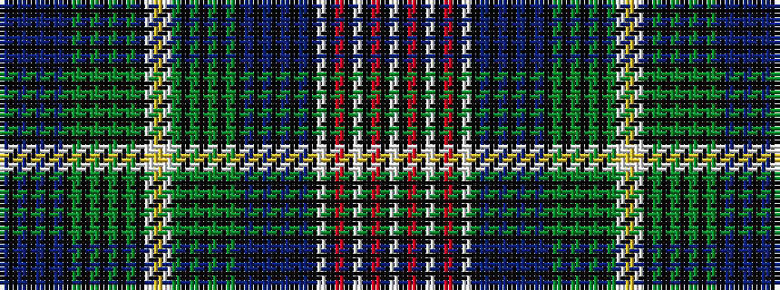

BKBKBKBKGKGKGKGKWYWGKGKGKGKBKBKBKBKWKRKWKRKW

It is a 44 stripe tartan.

<figure class="pat-woven">

<figcaption>idealised sample</figcaption>
</figure>

## Colour Sequence



## Tartans with this colour sequence

| Tartans |
|---------------|
| [Coutts 80th (James Robert)](/variants/s44/db11k1db1k1db1k1db1k11dg11k1dg1k1dg1k1dg1k1w4ly4w4dg11k1dg1k1dg1k1dg1k11db11k1db1k1db1k1db1k1w4k1r4k1w22k1r4k1w4~x2/)|
||
