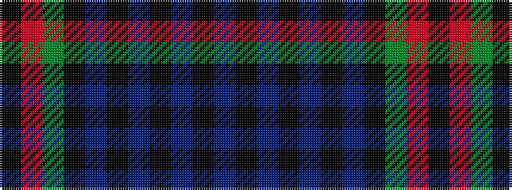

BKBKBKBKGRK

It is a 11 stripe tartan.

<figure class="pat-woven">

<figcaption>idealised sample</figcaption>
</figure>

## Colour Sequence



## Tartans with this colour sequence

| Tartans |
|---------------|
| [Bijral](/variants/s11/k2r1dg10k10t4k2t2k2t5k2t2~x2/)|
||
