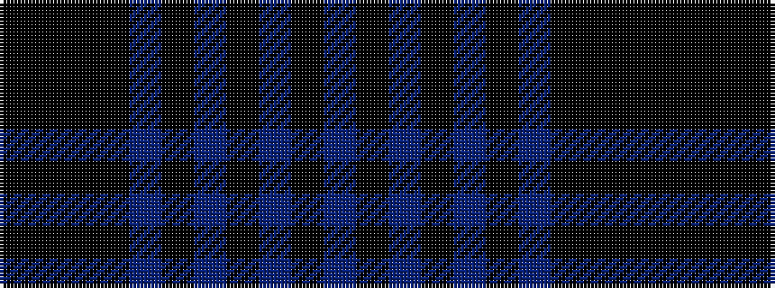

BKBKBKBKKKK

It is a 11 stripe tartan.

<figure class="pat-woven">

<figcaption>idealised sample</figcaption>
</figure>

## Colour Sequence



## Tartans with this colour sequence

| Tartans |
|---------------|
| [Lunar (Fashion)](/setts/s11/k10k1k3k7n1k1n1k1n1k1n7~x4/)|
||
