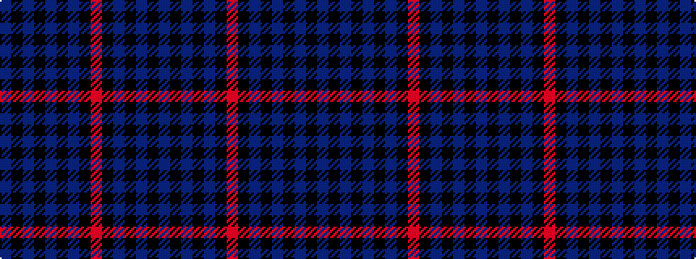

BKBKBKBKRKBKBKB

It is a 15 stripe tartan.

<figure class="pat-woven">

<figcaption>idealised sample</figcaption>
</figure>

## Colour Sequence



## Tartans with this colour sequence

| Tartans |
|---------------|
| [Mundigl](/setts/s15/bi12k2bi2k2bi2k10r2k10b12k3b12k10bi11k2bi2~x2/)|
||
| [Mundigl Family Tartan Tartan Number: 6066. Earliest known date: 2003 We chose blue because we liked it See products available Copyright © Blair Urquhart, Comrie, 2015](/setts/s15/db12k2db2k2db2k10r2k10dbi12k3dbi12k10db11k2db2~x2/)|
||
