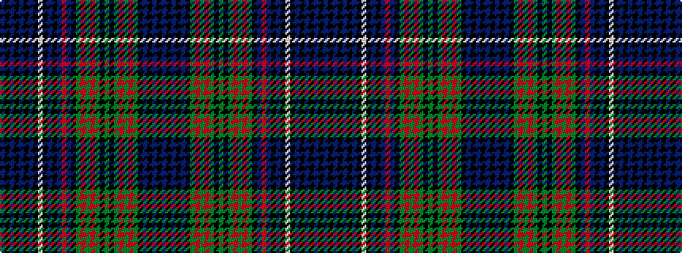

BKBKBKBKWKBKBRBKGRGRGKGKGRGRGKBKBKB

It is a 35 stripe tartan.

<figure class="pat-woven">

<figcaption>idealised sample</figcaption>
</figure>

## Colour Sequence



## Tartans with this colour sequence

This pattern is a design lineage: every tartan below shares one colour order, whatever its owner —
near-identical designs are grouped, the largest lineage first (#112: the pattern is a tartan's
second parent, beside its family or clan).

<table class="sett-table">
<tbody>
<tr><td><a href="/variants/s35/db26k3db3k3db3k24db26k1w5k1db26k24db17r26db17k24g15r4g4r4g8k1y5k1g8r4g4r4g15k24db3k3db3k3db26~x2/">Unidentified Wilson sample</a></td></tr>
<tr><td class="sett-swatch"></td></tr>
</tbody>
</table>

