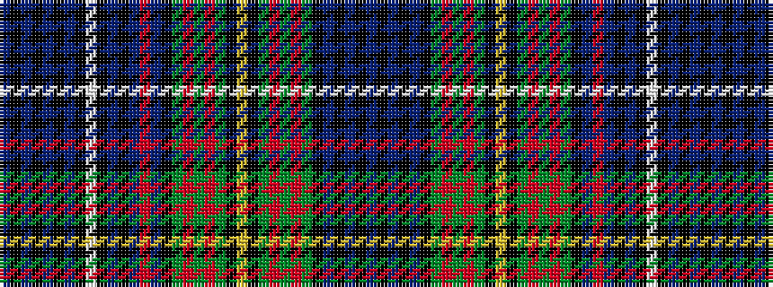

BKBKBKBKWKBKBRBKGRGRGKYKGRGRGKBKBKB

It is a 35 stripe tartan.

<figure class="pat-woven">

<figcaption>idealised sample</figcaption>
</figure>

## Colour Sequence



## Tartans with this colour sequence

| Tartans |
|---------------|
| [Unidentified Wilson sample](/setts/s35/db26k3db3k3db3k24db26k1w5k1db26k24db17r26db17k24dg15r4dg4r4dg8k1ly5k1dg8r4dg4r4dg15k24db3k3db3k3db26~x2/)|
||
| [Unidentified, Wilson sample.](/setts/s35/db26k3db3k3db3k24db26k1w5k1db26k24db17r26db17k24g15r4g4r4g8k1ly5k1g8r4g4r4g15k24db3k3db3k3db26~x2/)|
||
