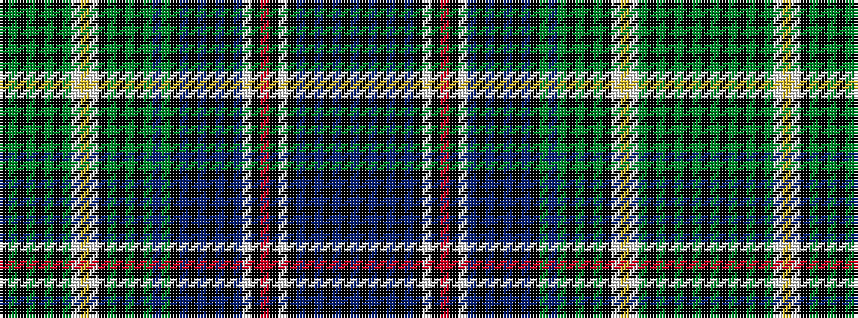

BKBKBKBKWKRKWBKBKBKBKGBGKGKGKWYWGKGKGKGK

It is a 40 stripe tartan.

<figure class="pat-woven">

<figcaption>idealised sample</figcaption>
</figure>

## Colour Sequence



## Tartans with this colour sequence

| Tartans |
|---------------|
| [Coutts 75th (Name)](/variants/s40/k12g1k1g1k1g1k1g12lb4ly4lb4k1g1k1g1k1g1db1g12k12db1k1db1k1db1k1db12lb4k1r4k1lb4k1db1k1db1k1db1k1db12~x2/)|
||
