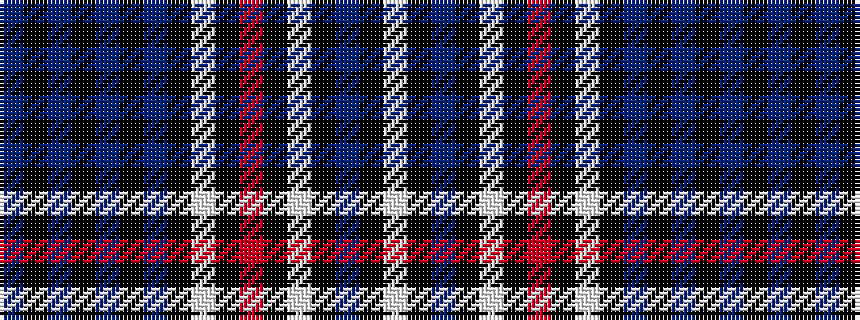

BKBKBKBKWKRKWKBKW

It is a 17 stripe tartan.

<figure class="pat-woven">

<figcaption>idealised sample</figcaption>
</figure>

## Colour Sequence



## Tartans with this colour sequence

| Tartans |
|---------------|
| [Donside Trampoline Club](/variants/s17/b12k2b2k2b2k2b2k12lt5k1m2k1lt5k12b12k1w2~x2/)|
||
