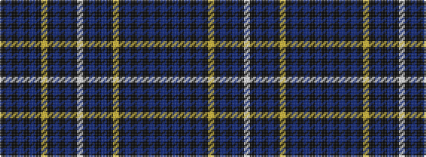

BKBKBKBKYKBKBKWKBKBKYKBKBKBK

It is a 28 stripe tartan.

<figure class="pat-woven">

<figcaption>idealised sample</figcaption>
</figure>

## Colour Sequence



## Tartans with this colour sequence

| Tartans |
|---------------|
| [Fleming Commemorative Tartan](/variants/s28/db16k3db3k3db3k16db17k2ly4k2db17k16db17k2w4~x2/)|
||
