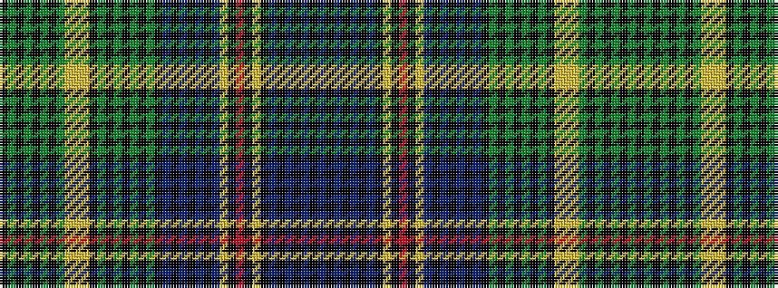

BKBKBKBKYKRKYBKBKBKBKGKGKGKGKYYYGKGKGKGK

It is a 40 stripe tartan.

<figure class="pat-woven">

<figcaption>idealised sample</figcaption>
</figure>

## Colour Sequence



## Tartans with this colour sequence

| Tartans |
|---------------|
| [Coutts 75th (James Robert )](/variants/s40/k12g1k1g1k1g1k1g12lg4ly4lg4k1g1k1g1k1g1k1g12k12b1k1b1k1b1k1b12lg4k1r4k1lg4k1b1k1b1k1b1k1b12~x2/)|
||
