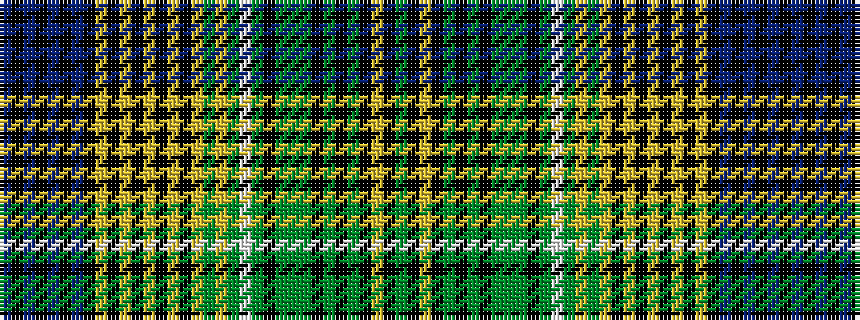

BKBKBKBKYKYKYKYKYGYGWGKGGGKGKGKYKG

It is a 34 stripe tartan.

<figure class="pat-woven">

<figcaption>idealised sample</figcaption>
</figure>

## Colour Sequence



## Tartans with this colour sequence

| Tartans |
|---------------|
| [Unidentified](/variants/s34/db8k1db3k2db2k3db1k11ly2k4ly3k3ly4k2ly5k1ly55g4ly11g11w4g66k1g5g2g4k3g3k4g2k11ly15k2g4~x2/)|
||
