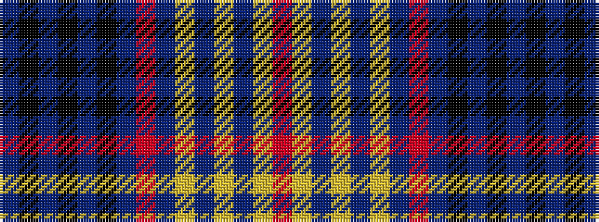

BKBKBKBRBYBYBYR

It is a 15 stripe tartan.

<figure class="pat-woven">

<figcaption>idealised sample</figcaption>
</figure>

## Colour Sequence



## Tartans with this colour sequence

| Tartans |
|---------------|
| [(3) Laing](/setts/s15/db1k6db2k8db2ki2db52r2db2ly8db2ly6db2ly2r1~x2/)|
||
