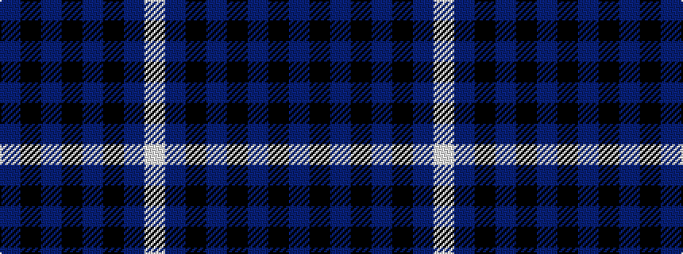

BKBKBKBW

It is a 8 stripe tartan.

<figure class="pat-woven">

<figcaption>idealised sample</figcaption>
</figure>

## Colour Sequence



## Tartans with this colour sequence

| Tartans |
|---------------|
| [Blue Spirit](/variants/s8/db3k13db3k22db49k2db2lb1~x2/)|
||
| [Blue Spirit Fashion Tartan](/variants/s8/db3k12db3k17db40k2db2w1~x2/)|
||
| [Sabema](/variants/s8/db25k3db7k15b25k2b2w4~x2/)|
||
