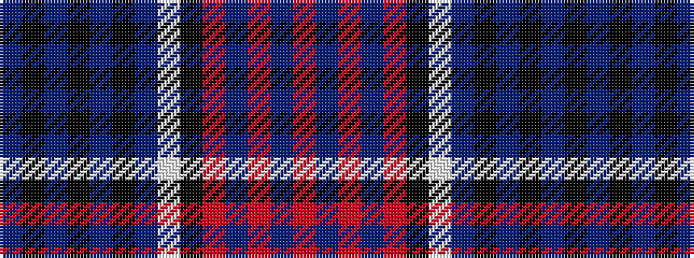

BKBKBKBWKRBRBR

It is a 14 stripe tartan.

<figure class="pat-woven">

<figcaption>idealised sample</figcaption>
</figure>

## Colour Sequence



## Tartans with this colour sequence

| Tartans |
|---------------|
| [Sydney Academy](/variants/s14/n31k4n4k4n4k4n6w5k4o3dp19o3n4r3~x2/)|
||
