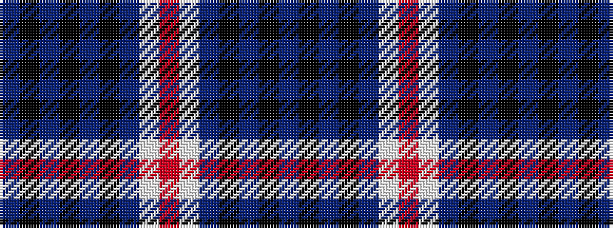

BKBKBKBWRWBKBKB

It is a 15 stripe tartan.

<figure class="pat-woven">

<figcaption>idealised sample</figcaption>
</figure>

## Colour Sequence



## Tartans with this colour sequence

| Tartans |
|---------------|
| [Palatine Union Personal Tartan](/variants/s15/db13k3db3k3db3k10t10w4r4w4t10k10db14k3db3~x2/)|
||
