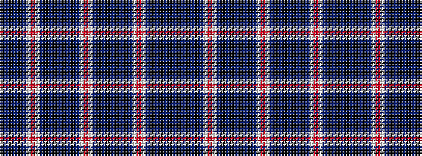

BKBKBKBWRWBKBKBKBKBWRWBKBKBKBKBWRWBKBKBK

It is a 40 stripe tartan.

<figure class="pat-woven">

<figcaption>idealised sample</figcaption>
</figure>

## Colour Sequence



## Tartans with this colour sequence

| Tartans |
|---------------|
| [Palatine Union (Personal)](/setts/s40/db13k3db3k3db3k10t10w4r4w4t10k10db14k3db3k3db14k10t8w3r3w3t8k10db13k3db3k3db13k10t10w4r4w4t10k10db3k3db3k3~x2/)|
||
