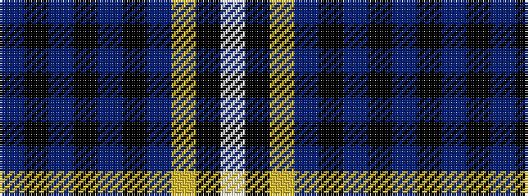

BKBKBKBYKW

It is a 10 stripe tartan.

<figure class="pat-woven">

<figcaption>idealised sample</figcaption>
</figure>

## Colour Sequence



## Tartans with this colour sequence

| Tartans |
|---------------|
| [Scruffy Wallace](/setts/s10/t6k74t6k6t6k6t20lg30k3w6/)|
||
