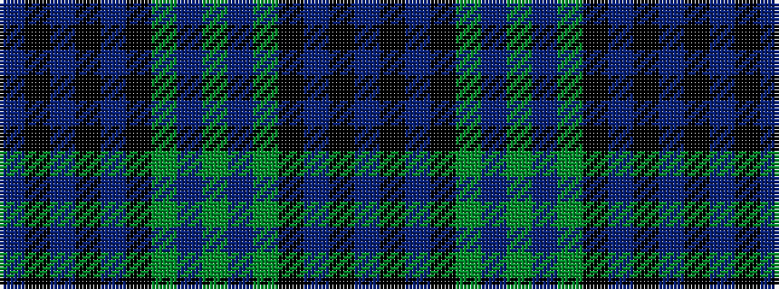

BKBKBKGBGBGKBKB

It is a 15 stripe tartan.

<figure class="pat-woven">

<figcaption>idealised sample</figcaption>
</figure>

## Colour Sequence



## Tartans with this colour sequence

| Tartans |
|---------------|
| [Blanton (Name)](/setts/s15/b12k2b2k2b2k10g5dp3g2dp3g5k10b11k2b2~x2/)|
||
