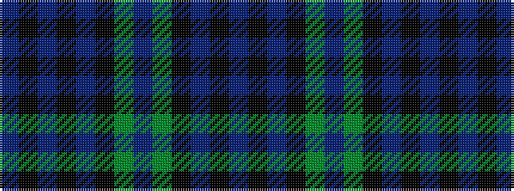

BKBKBKGBGKBKB

It is a 13 stripe tartan.

<figure class="pat-woven">

<figcaption>idealised sample</figcaption>
</figure>

## Colour Sequence



## Tartans with this colour sequence

| Tartans |
|---------------|
| [Blanton](/variants/s13/b24k2b2k2b2k10g5dp3g5k10b11k2b4~x2/)|
||
| [Cheape](/setts/db6k1db1k1db1k6g6t2g6k6db6k1db2/)|
||
| [Cheape of Torosay](/variants/s13/db6k1db1k1db1k6dg6t2dg6k6db6k1db2~x2/)|
||
