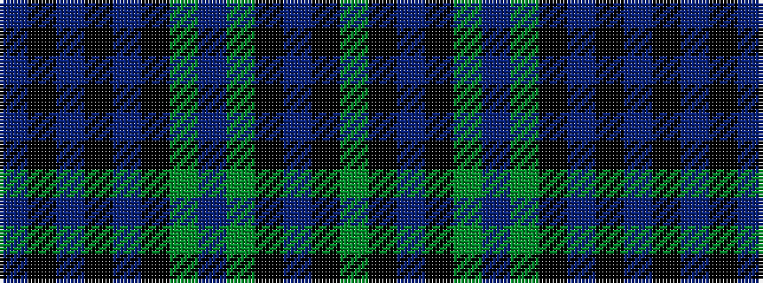

BKBKBKGBGKBKG

It is a 13 stripe tartan.

<figure class="pat-woven">

<figcaption>idealised sample</figcaption>
</figure>

## Colour Sequence



## Tartans with this colour sequence

| Tartans |
|---------------|
| [Cheape of Torosay #2 (Personal)](/setts/s13/db6k1db1k1db1k6g6t2g6k6db6k1g2~x4/)|
||
