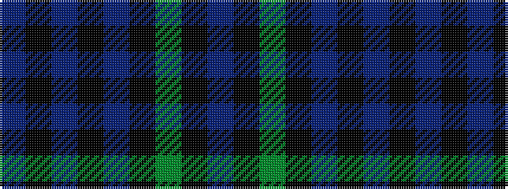

BKBKBKGKB

It is a 9 stripe tartan.

<figure class="pat-woven">

<figcaption>idealised sample</figcaption>
</figure>

## Colour Sequence



## Tartans with this colour sequence

| Tartans |
|---------------|
| [Comme Ça Il Conte](/setts/s9/dti16k3dti40k22db3k25dg3k6dt10/)|
||
