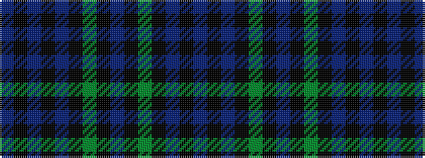

BKBKBKGKBKGKBKB

It is a 15 stripe tartan.

<figure class="pat-woven">

<figcaption>idealised sample</figcaption>
</figure>

## Colour Sequence



## Tartans with this colour sequence

| Tartans |
|---------------|
| [Rogers (Personal)](/setts/s15/db8k1db2k1db2k6dg8k1t2k1dg8k6db8k1db2~x4/)|
||
