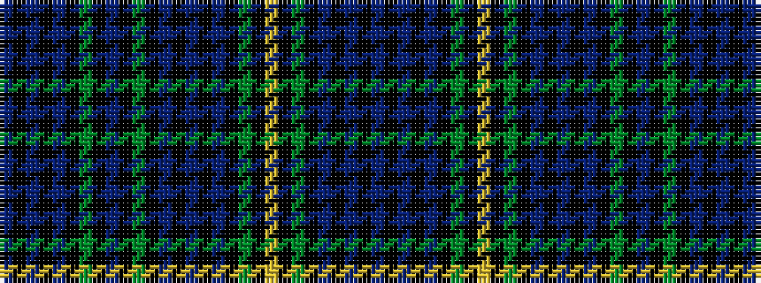

BKBKBKGKBKGKBKBKBKGKYKGKBKBKB

It is a 29 stripe tartan.

<figure class="pat-woven">

<figcaption>idealised sample</figcaption>
</figure>

## Colour Sequence



## Tartans with this colour sequence

| Tartans |
|---------------|
| [Broun Hunting (Personal?)](/variants/s29/dt16k3dt3k3dt3k16g15k1t3k1g15k16dt15k3dt3k3dt15k16g15k1lr3k1g15k16dt3k3dt3k3dt3~x4/)|
||
