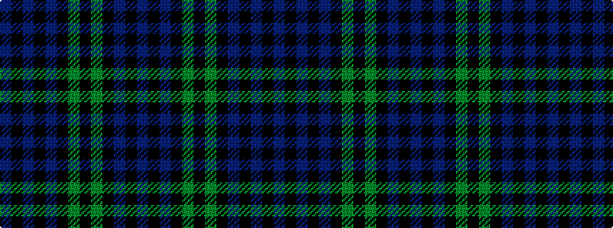

BKBKBKGKGKBKB

It is a 13 stripe tartan.

<figure class="pat-woven">

<figcaption>idealised sample</figcaption>
</figure>

## Colour Sequence



## Tartans with this colour sequence

This pattern is a design lineage: every tartan below shares one colour order, whatever its owner —
near-identical designs are grouped, the largest lineage first (#112: the pattern is a tartan's
second parent, beside its family or clan).

<table class="sett-table">
<tbody>
<tr><td><a href="/variants/s13/db16k3db3k3db3k16dg15k3dg15k16db15k3db3~x2~db0806265/">93rd Regiment (Military)</a></td></tr>
<tr><td class="sett-swatch"></td></tr>
<tr><td><a href="/variants/s13/db11k1db1k1db1k8dg8k1dg8k8db8k1db1~x2/">Black Watch Regimental Tartan</a></td></tr>
<tr><td class="sett-swatch"></td></tr>
<tr><td><a href="/variants/s13/db14k3db3k3db3k16g16k3g16k16db16k3db3~x2/">Campbell</a></td></tr>
<tr><td class="sett-swatch"></td></tr>
<tr><td><a href="/variants/s13/db2k2db11k10g12k3g12k10db2k2db2k2db2~x2/">Campbell</a></td></tr>
<tr><td class="sett-swatch"></td></tr>
<tr><td><a href="/setts/db11k1db1k1db1k8g8k1g8k8db8k1db1/">Campbell</a></td></tr>
<tr><td class="sett-swatch"></td></tr>
<tr><td><a href="/variants/s13/db12k2db2k2db2k10g12k3g12k10db11k2db2~x2/">Campbell Clan Tartan</a></td></tr>
<tr><td class="sett-swatch"></td></tr>
<tr class="cluster-sep"><td></td></tr>
<tr><td><a href="/variants/s13/dt16k3dt3k3dt3k16g15k3g15k16dt15k3dt3~x2/">42nd Regiment (Military)</a></td></tr>
<tr><td class="sett-swatch"></td></tr>
<tr class="cluster-sep"><td></td></tr>
<tr><td><a href="/variants/s13/do12k2do2k2do2k10g12k3g12k10do12k2do2~x2/">Brown Watch (Fashion)</a></td></tr>
<tr><td class="sett-swatch"></td></tr>
</tbody>
</table>

