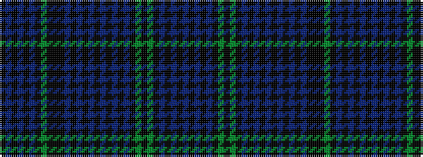

BKBKBKGKGKBKBKBKBKBKBKKKGKBKBKBK

It is a 32 stripe tartan.

<figure class="pat-woven">

<figcaption>idealised sample</figcaption>
</figure>

## Colour Sequence



## Tartans with this colour sequence

| Tartans |
|---------------|
| [Hawick Dress (District)](/setts/s32/k2db4k2db3k2db2k12g2k12k12k12db2k2db3k2db4k4db4k2db3k2db2k16g2k24g2k16db2k2db3k2db2~x2/)|
||
