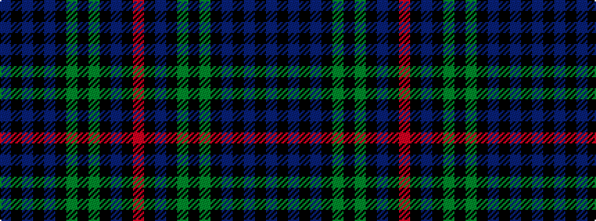

BKBKBKGKGKBKR

It is a 13 stripe tartan.

<figure class="pat-woven">

<figcaption>idealised sample</figcaption>
</figure>

## Colour Sequence



## Tartans with this colour sequence

This pattern is a design lineage: every tartan below shares one colour order, whatever its owner —
near-identical designs are grouped, the largest lineage first (#112: the pattern is a tartan's
second parent, beside its family or clan).

<table class="sett-table">
<tbody>
<tr><td><a href="/tartans/b/bl/black-watch-isetan-men-s/">Black Watch/Isetan Men's</a></td></tr>
<tr><td class="sett-swatch"></td></tr>
<tr><td><a href="/tartans/n/no/norwich-no-007/">Norwich No.007</a></td></tr>
<tr><td class="sett-swatch"></td></tr>
<tr class="cluster-sep"><td></td></tr>
<tr><td><a href="/tartans/r/re/red-hackle/">Red Hackle</a></td></tr>
<tr><td class="sett-swatch"></td></tr>
<tr class="cluster-sep"><td></td></tr>
<tr><td><a href="/tartans/t/th/the-red-hackle/">The Red Hackle</a></td></tr>
<tr><td class="sett-swatch"></td></tr>
</tbody>
</table>

