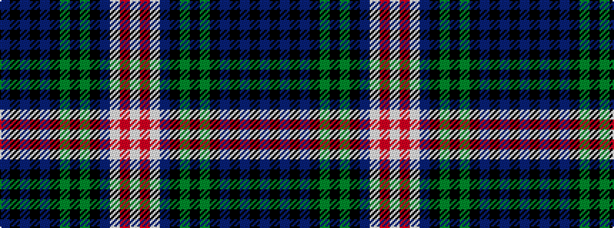

BKBKBKGKGKBWRW

It is a 14 stripe tartan.

<figure class="pat-woven">

<figcaption>idealised sample</figcaption>
</figure>

## Colour Sequence



## Tartans with this colour sequence

| Tartans |
|---------------|
| [Gemmell](/variants/s14/t8k1t1k1t1k5g6k1g6k6db3w1r1w1~x4/)|
||
| [Gemmell Clan Tartan](/variants/s14/db4k1db1k1db1k5g6k1g6k6db3w1r1w1~x4/)|
||
