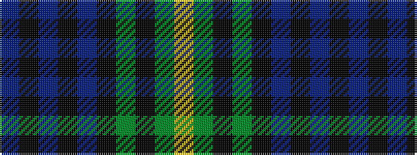

BKBKBKGKGY

It is a 10 stripe tartan.

<figure class="pat-woven">

<figcaption>idealised sample</figcaption>
</figure>

## Colour Sequence



## Tartans with this colour sequence

| Tartans |
|---------------|
| [Grand Lodge of Scotland (Corporate)](/setts/s10/db1k2db1k6db1k1g1k6g21ly1~x2/)|
||
