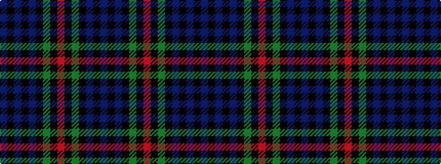

BKBKBKGKRKGKBKB

It is a 15 stripe tartan.

<figure class="pat-woven">

<figcaption>idealised sample</figcaption>
</figure>

## Colour Sequence



## Tartans with this colour sequence

This pattern is a design lineage: every tartan below shares one colour order, whatever its owner —
near-identical designs are grouped, the largest lineage first (#112: the pattern is a tartan's
second parent, beside its family or clan).

<table class="sett-table">
<tbody>
<tr><td><a href="/variants/s15/db6k2db2k2db2k6g8k1r2k1g8k6db8k2db2~x2/">MacKinlay</a></td></tr>
<tr><td class="sett-swatch"></td></tr>
<tr><td><a href="/variants/s15/db19k3db3k3db3k20g19k2r5k2g19k20db19k3db3~x2/">Safeway</a></td></tr>
<tr><td class="sett-swatch"></td></tr>
<tr><td><a href="/variants/s15/db38k6db6k6db6k40g38k4r9k4g38k40db38k6db6/">Safeway</a></td></tr>
<tr><td class="sett-swatch"></td></tr>
</tbody>
</table>

