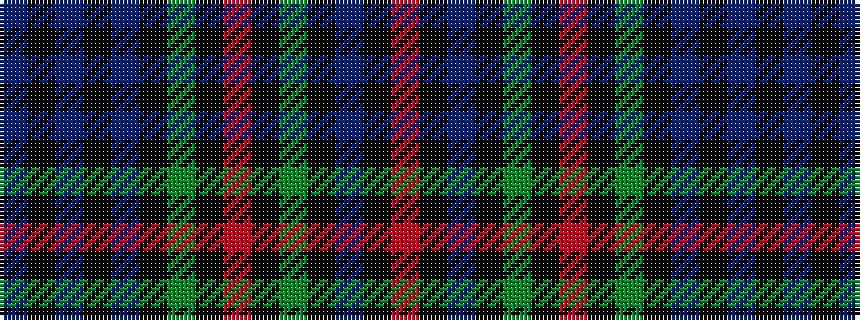

BKBKBKGKRKGKBKR

It is a 15 stripe tartan.

<figure class="pat-woven">

<figcaption>idealised sample</figcaption>
</figure>

## Colour Sequence



## Tartans with this colour sequence

| Tartans |
|---------------|
| [77th Regiment](/variants/s15/db16k3db3k3db3k16dg14k2r3k2dg14k16db14k2r3~x2/)|
||
