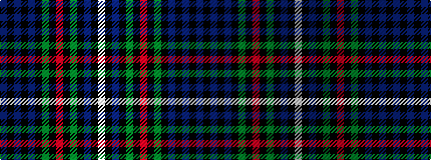

BKBKBKGKRKGKBKW

It is a 15 stripe tartan.

<figure class="pat-woven">

<figcaption>idealised sample</figcaption>
</figure>

## Colour Sequence



## Tartans with this colour sequence

| Tartans |
|---------------|
| [Robertson Htg - 1816 (Clan)](/variants/s15/db24k2db2k2db2k12g16k1r3k1g16k12db12k1w3~x2/)|
||
| [Robertson Hunting](/variants/s15/db24k2db2k2db2k12g16k1r2k1g16k12db12k1w3~x2/)|
||
| [Robertson of Kindeace](/variants/s15/db12k2db2k2db2k12dg16k1r3k1dg16k12db12k1lb3~x2/)|
||
| [Robertson of Kindeace](/variants/s15/db12k2db2k2db2k12g16k1r2k1g16k12db12k1w3~x2/)|
||
