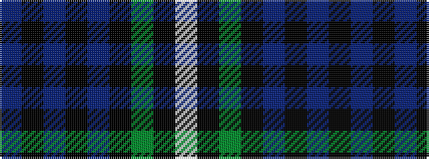

BKBKBKGKW

It is a 9 stripe tartan.

<figure class="pat-woven">

<figcaption>idealised sample</figcaption>
</figure>

## Colour Sequence



## Tartans with this colour sequence

| Tartans |
|---------------|
| [Forbes](/setts/s9/db8k2db2k2db2k8g7k1w1~x2/)|
||
| [Forbes #3](/setts/s9/db8k2db2k2db2k8dg7k1w1~x2/)|
||
| [Forbes #5](/setts/s9/db28k3db6k3db6k20dy28k3w6~x2/)|
||
