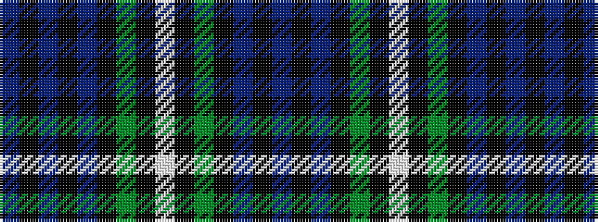

BKBKBKGKWKGKBKB

It is a 15 stripe tartan.

<figure class="pat-woven">

<figcaption>idealised sample</figcaption>
</figure>

## Colour Sequence



## Tartans with this colour sequence

| Tartans |
|---------------|
| [74th Regiment of Foot (Mil.)](/setts/s15/dt8k1dt2k1dt2k6g8k1w2k1g8k6dt8k1dt2~x4/)|
||
| [Forbes](/setts/s15/db8k1db2k1db2k6g8k1w2k1g8k6db8k1db2~x4/)|
||
| [Forbes](/setts/s15/db8k1db2k1db2k6dg8k1lb2k1dg8k6db8k1db2/)|
||
| [Forbes](/setts/s15/db17k3db3k3db3k16g15k2w3k2g15k16db16k3db3~x2/)|
||
| [Forbes](/setts/s15/db8k1db2k1db2k6g8k1w2k1g8k6db8k1db2~x2/)|
||
| [Forbes #2](/setts/s15/db17k3db3k3db3k16dg15k2w3k2dg15k16db16k3db3~x2/)|
||
| [Rogers Family (Kilkeel) (Personal)](/setts/s15/db8k1db2k1db2k6g8k1lt2k1g8k6db8k1db2~x4/)|
||
