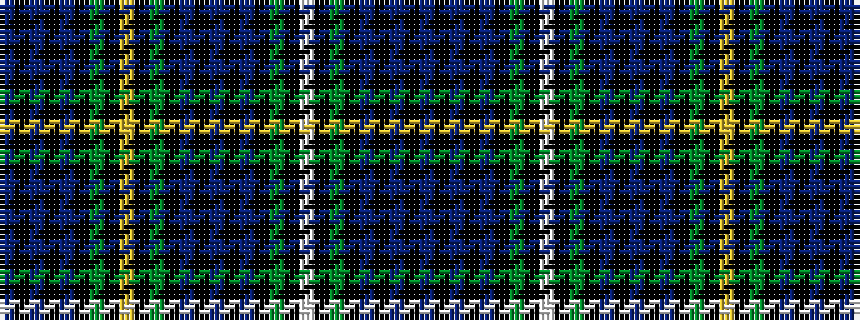

BKBKBKGKWKGKBKBKBKGKYKGKBKBKB

It is a 29 stripe tartan.

<figure class="pat-woven">

<figcaption>idealised sample</figcaption>
</figure>

## Colour Sequence



## Tartans with this colour sequence

| Tartans |
|---------------|
| [Campbell](/setts/s29/db4k1db1k1db1k8g8k1w2k1g8k8db8k1db1k1db8k8g8k1ly2k1g8k8db1k1db1k1db4~x8/)|
||
