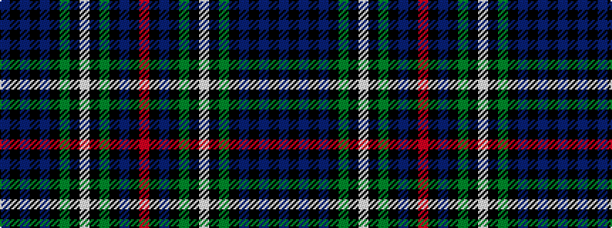

BKBKBKGKWKGKBKR

It is a 15 stripe tartan.

<figure class="pat-woven">

<figcaption>idealised sample</figcaption>
</figure>

## Colour Sequence



## Tartans with this colour sequence

This pattern is a design lineage: every tartan below shares one colour order, whatever its owner —
near-identical designs are grouped, the largest lineage first (#112: the pattern is a tartan's
second parent, beside its family or clan).

<table class="sett-table">
<tbody>
<tr><td><a href="/variants/s15/db17k3db3k3db3k17dg17k2w3k2dg17k17db17k2r3~x2/">Cumbernauld District Tartan</a></td></tr>
<tr><td class="sett-swatch"></td></tr>
<tr><td><a href="/setts/db12k2db2k2db2k12g12k1w2k1g12k12db12k1r2/">MacKenzie</a></td></tr>
<tr><td class="sett-swatch"></td></tr>
<tr><td><a href="/variants/s15/db12k2db2k2db2k12dg12k1w2k1dg12k12db12k1r2~x2/">MacKenzie - 1780 (Clan) as 78th</a></td></tr>
<tr><td class="sett-swatch"></td></tr>
<tr><td><a href="/variants/s15/db12k2db2k2db2k12g12k1w3k1g12k12db12k1r3~x2/">MacKenzie Clan Tartan</a></td></tr>
<tr><td class="sett-swatch"></td></tr>
<tr><td><a href="/variants/s15/db6k1db1k1db1k6g6k1w2k1g6k6db6k1r2~x2/">MacKenzie MINI Clan Miniature Tartan</a></td></tr>
<tr><td class="sett-swatch"></td></tr>
<tr class="cluster-sep"><td></td></tr>
<tr><td><a href="/variants/s15/dt30k5dt5k5dt5k31dg31k3w7k3dg31k31dt31k3r7/">78th Regiment (Highlanders) (Mil.)</a></td></tr>
<tr><td class="sett-swatch"></td></tr>
</tbody>
</table>

