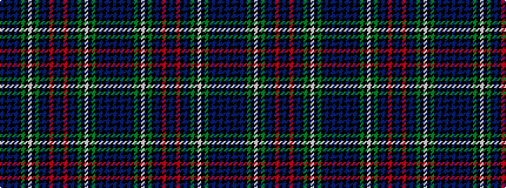

BKBKBKGKWKGKBKRKBKRKBKGKWKGKBKBKB

It is a 33 stripe tartan.

<figure class="pat-woven">

<figcaption>idealised sample</figcaption>
</figure>

## Colour Sequence



## Tartans with this colour sequence

| Tartans |
|---------------|
| [MacKenzie](/variants/s33/db14k3db3k3db3k14g14k3w3k3g14k14db14k3r3k14db14k3r3k3db14k14g14k3w3k3g14k14db3k3db3k3db7~x4/)|
||
