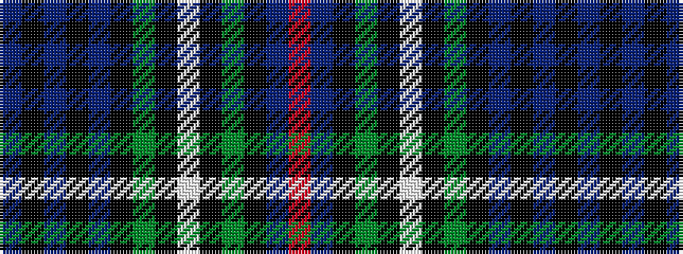

BKBKBKGKWKGKBR

It is a 14 stripe tartan.

<figure class="pat-woven">

<figcaption>idealised sample</figcaption>
</figure>

## Colour Sequence



## Tartans with this colour sequence

| Tartans |
|---------------|
| [MacKenzie](/setts/s14/db10k2db2k2db2k8g8k1w2k1g8k8db9r2~x2/)|
||
