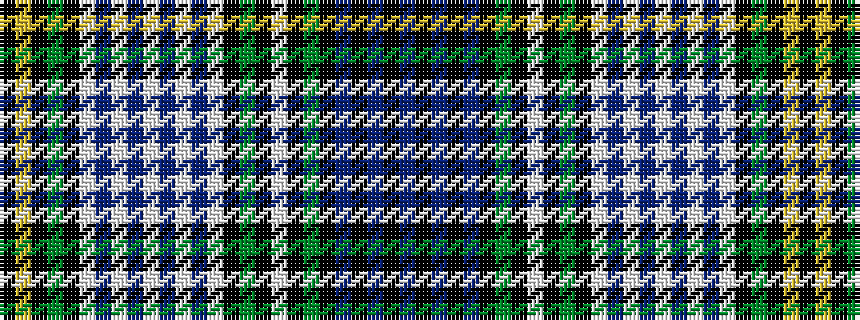

BKBKBKGKWKGKWBWBWBWBWKGKYK

It is a 26 stripe tartan.

<figure class="pat-woven">

<figcaption>idealised sample</figcaption>
</figure>

## Colour Sequence



## Tartans with this colour sequence

| Tartans |
|---------------|
| [Campbell of Loch Neil Dress Clan Tartan Tartan Number: 1963. Earliest known date: pre 2003 Sample 1984 See products available Copyright © Blair Urquhart, Comrie, 2015](/setts/s26/db12k2db6k2db12k12g14k2w4k2g14k10w6db6w18db3w4db3w18db6w6k10g14k2ly4k2/)|
||
