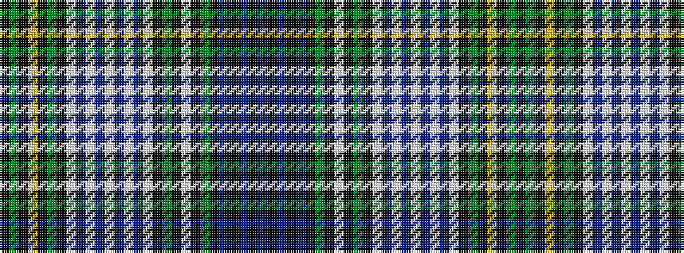

BKBKBKGKWKGKWBWBWBWBWKGKYKGK

It is a 28 stripe tartan.

<figure class="pat-woven">

<figcaption>idealised sample</figcaption>
</figure>

## Colour Sequence



## Tartans with this colour sequence

| Tartans |
|---------------|
| [Campbell of Loch Neil Dress](/setts/s28/k20dg14k2ly4k2dg14k10w6db6w18db3w4db3w18db6w6k10dg14k2w4k2dg14k12db12k2db6k2db12/)|
||
| [Campbell of Loch Neil, dress](/setts/s28/k20g14k2ly4k2g14k10w6db6w18db3w4db3w18db6w6k10g14k2w4k2g14k12db12k2db6k2db12/)|
||
