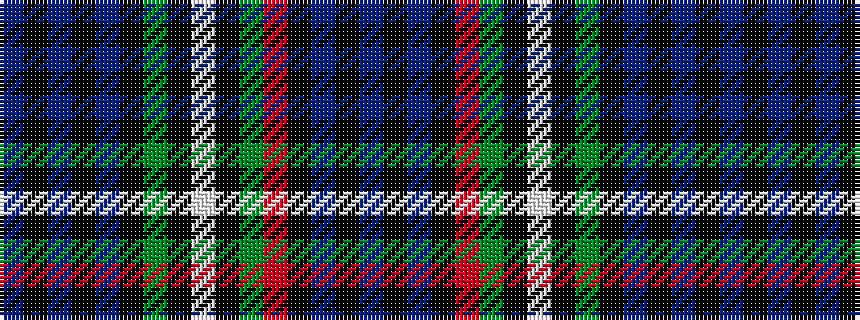

BKBKBKGKWKGRKBKB

It is a 16 stripe tartan.

<figure class="pat-woven">

<figcaption>idealised sample</figcaption>
</figure>

## Colour Sequence



## Tartans with this colour sequence

| Tartans |
|---------------|
| [Sempill (Clan)](/setts/s16/b22k3b3k3b3k15g19k1lb3k1g19r2k15b19k3b3~x2/)|
||
