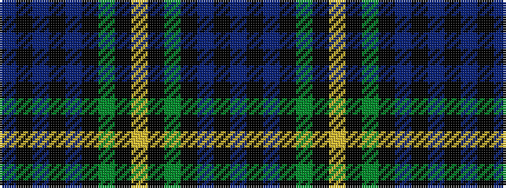

BKBKBKGKYKGKBKB

It is a 15 stripe tartan.

<figure class="pat-woven">

<figcaption>idealised sample</figcaption>
</figure>

## Colour Sequence



## Tartans with this colour sequence

| Tartans |
|---------------|
| [Forbes](/tartans/db8k1db2k1db2k6dg8k1lr2k1dg8k6db8k1db2/)|
||
| [Gordon 2](/setts/s15/db23k3db3k3db3k17g22k2ly4k2g22k17db22k3db3~x2/)|
||
