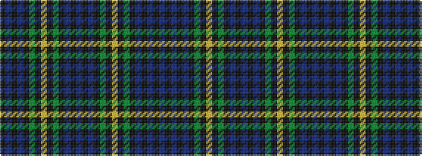

BKBKBKGKYKGKBKBKBKGKYKGKBKBK

It is a 28 stripe tartan.

<figure class="pat-woven">

<figcaption>idealised sample</figcaption>
</figure>

## Colour Sequence



## Tartans with this colour sequence

| Tartans |
|---------------|
| [Gordon Clan](/setts/s28/db23k3db3k3db3k17g22k2ly4k2g22k17db22k3db3~x2/)|
||
