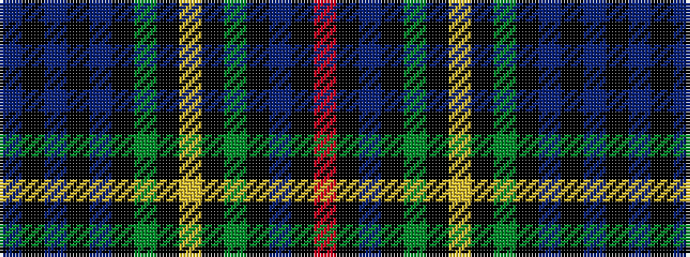

BKBKBKGKYKGKBKR

It is a 15 stripe tartan.

<figure class="pat-woven">

<figcaption>idealised sample</figcaption>
</figure>

## Colour Sequence



## Tartans with this colour sequence

| Tartans |
|---------------|
| [Bailey, The House of](/variants/s15/db28k4t4k4db4k4g26k2ly5k2g26k4db40k4r10/)|
||
| [Baillie](/variants/s15/db28k4db4k4db4k28g26k3ly5k3g26k28db26k3r5/)|
||
| [Baillie (William Wilson)](/variants/s15/db28k4db4k4db4k28g27k3ly5k3g27k28db27k3r5~x2/)|
||
| [MacKenzie](/setts/db12k2db2k2db2k12dg12k1lr2k1dg12k12db12k1r2/)|
||
