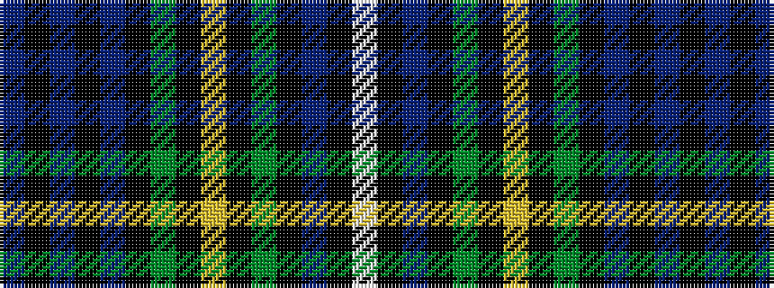

BKBKBKGKYKGKBKW

It is a 15 stripe tartan.

<figure class="pat-woven">

<figcaption>idealised sample</figcaption>
</figure>

## Colour Sequence



## Tartans with this colour sequence

| Tartans |
|---------------|
| [Glengoyne Distillery Corporate Tartan Tartan Number: 1144. Earliest known date: 1993 Designed for the Glengoyne Distillery by Lochcarron of Scotland in 1993. See products available Copyright © Blair Urquhart, Comrie, 2015](/setts/s15/db11k3db3k3db3k9g9k1ly3k1g9k9db9k1w3~x2/)|
||
